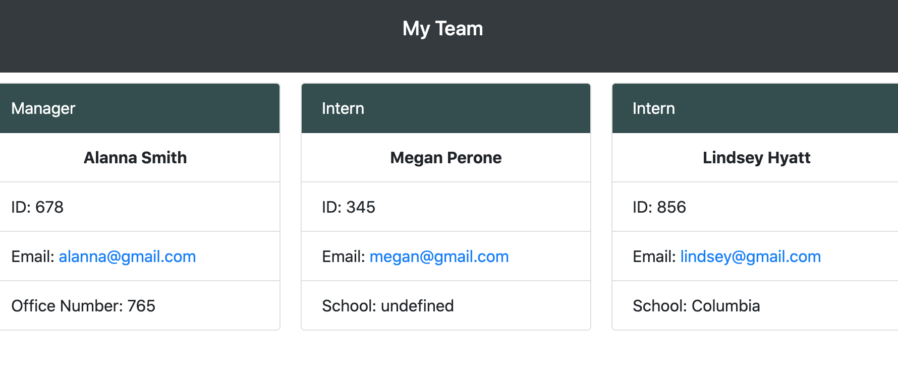

# Team Profile Generator

## Table of Contents
* [Description](#description)
* [URL](#url)
* [Installation](#installation)
* [License](#license)
* [Contributing](#contributing)
* [Tests](#tests)
* [Questions](#questions)
## Description 
The Team Profile Generator is a command-line tool that allows users to input info about employees. Users can quickly and easily build their teams within the company and add any additional, useful notes about those team members. This application was specifically made for a software developing team. Which, includes a Manager, Engineer(s), and Intern(s).
## URL
[Click here to see the live site!]()

## Installation
Clone the repo and run npm run test and node index.js

## Contributing
Open source, feel free to modify! 

## Tests

## Questions
Please contact me below with any questions you have about the appiction.
* Github: https://github.com/lindseybowen
